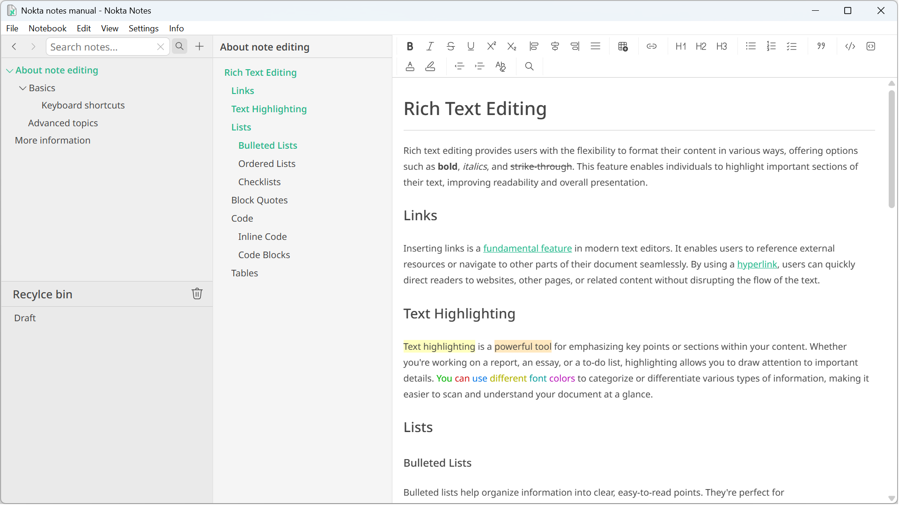

## About Nokta Notes
**Nokta notes** is a free, no nonsense note editor with a clean interface and a focus on usability. It uses its own file format (.nokta files) and supports unlimited nested notes

#### 📂 [Download the latest version here](https://github.com/NoktaNotes/download/releases/latest/download/Nokta_0.10.0_x64_en-US.msi)
##### ℹ️ [Latest release info](https://github.com/NoktaNotes/download/releases)
##### 🔎 [Download the manual (.nokta file)](https://github.com/NoktaNotes/download/raw/main/Manual.nokta)

### Key Features
* Rich text note editing
* Flexible panels: hierarchy, table of contents, editor
* Search and replace
* Dark and light theme
* Always saved, never lose your work
* Lightweight and fast

### System Requirements
- Windows 11
- 64-bit processor

